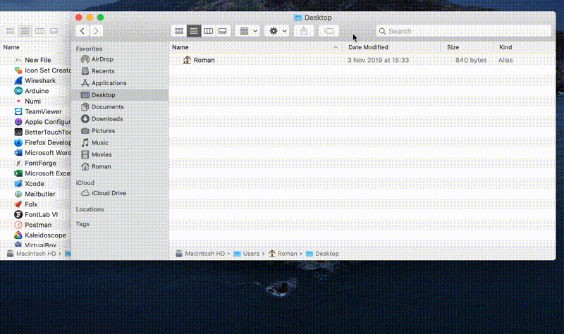
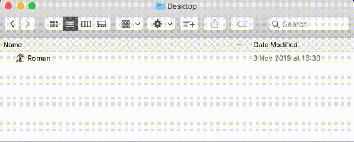

# New File [macOS Finder] 

Ever wanted to simply create a new empty file inside the current directory from Finder just like you are used to in Windows?

This is an AppleScript based application that will create an empty file in the current Finder window. 

It's icon is designed to fit seamlessly into your Finder's toolbar.

## How to Use
Copy the "New File.app" to your Applications directory or wherever you like. Then drag and drop the app to the toolbar in Finder to create a shortcut.

Starting from Catalina, the app will ask for access to "Finder" and "System Events". Accessibility features also need to be allowed for the script to work correctly.

If you want to use the script in another manner, you can grab it from "New File.applescript"

----

